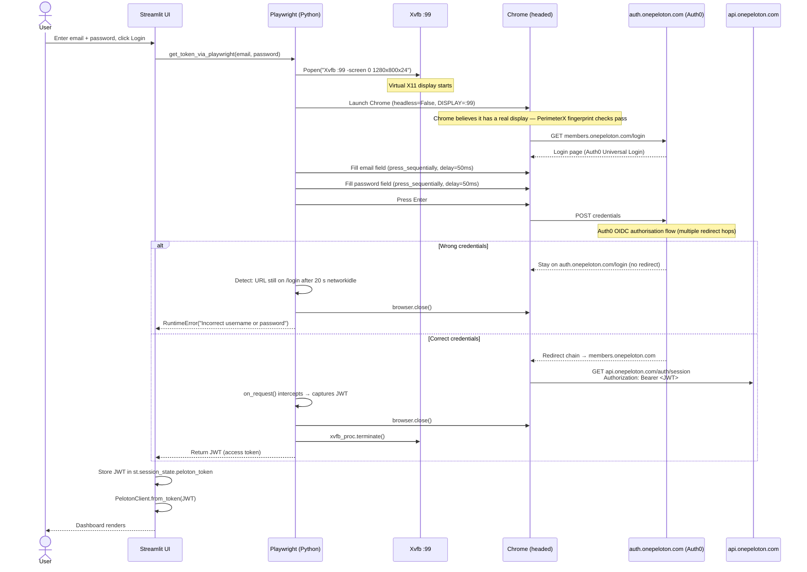
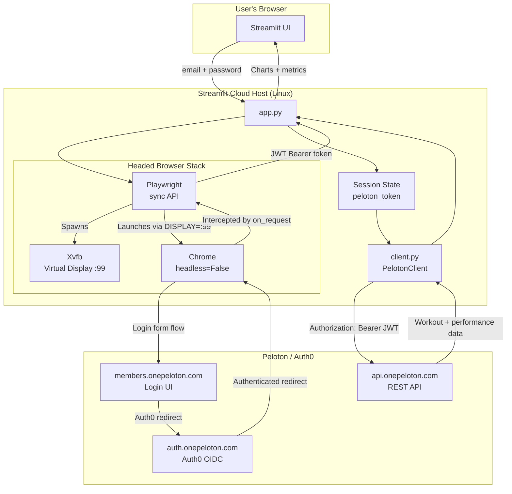

# Peloton Dashboard — Login Architecture

## Background

Peloton migrated their authentication to **Auth0** in 2025. This closed every
previously-available programmatic login path:

| Approach | Outcome |
|---|---|
| Legacy `/auth/login` REST endpoint | 403 — "Endpoint no longer accepting requests" |
| Auth0 ROPC password grant (`/oauth/token`) | 403 — "Grant type 'password' not allowed" |
| Auth0 cross-origin auth (`/co/authenticate`) | 403 — "Cross origin login not allowed" |
| Headless Playwright (datacenter IP) | Silent block by PerimeterX bot detection |

The only path that works from a cloud host is a **headed browser** — one
with a real X11 display — because PerimeterX's fingerprinting checks pass
only when Chrome reports a non-headless rendering environment.

---

## High-Level Approach

```
User credentials → Playwright + Xvfb → Full Auth0 browser login → Capture JWT
```

The app drives a real Chrome browser through the Auth0 login UI on behalf of
the user. Playwright intercepts the network request that Chrome makes to
`api.onepeloton.com` immediately after login; the Bearer token in that
request's `Authorization` header is the Peloton API credential.

The user's password is held only in memory for the duration of the login
call. It is never stored on disk or sent anywhere except to `auth.onepeloton.com`.

---

## Login Sequence



---

## Logical Architecture



---

## Token Details

The captured token is a **JSON Web Token (JWT)** — a three-part
base64url-encoded string (`header.payload.signature`).

### Relevant claims

| Claim | Value |
|---|---|
| `http://onepeloton.com/user_id` | Peloton user UUID — used to scope API calls |
| `exp` | Unix timestamp expiry (~48 h after issue) |

### Validation (`PelotonClient.token_valid`)

```python
def token_valid(token, margin_s=300):
    # Must be a 3-part JWT
    if not token or token.count(".") != 2:
        return False
    # Must not expire within the next 5 minutes
    exp = jwt_claims(token).get("exp", 0)
    return time.time() < exp - margin_s
```

If the token is near expiry when the app loads, the user is prompted to log
in again. The token itself is never persisted to disk; it lives only in
`st.session_state` for the duration of the browser session.

---

## API Usage

All Peloton API calls use a shared `requests.Session` with the token in the
`Authorization` header:

```
Authorization: Bearer <JWT>
Peloton-Platform: web
User-Agent: Mozilla/5.0 ...
```

| Endpoint | Purpose |
|---|---|
| `GET /api/user/{user_id}/workouts` | List recent cycling workouts |
| `GET /api/workout/{workout_id}/performance_graph?every_n=1` | Per-second cadence, resistance, output |
| `GET /api/ride/{ride_id}/details` | Instructor target metrics (cadence/resistance ranges per segment) |

---

## Why Xvfb Is Load-Bearing

PerimeterX (the bot-detection layer on `auth.onepeloton.com`) inspects
browser fingerprints including:

- `navigator.webdriver` flag
- Canvas and WebGL rendering signatures
- Presence of a real display in the environment

A headless Chrome process (even with anti-detection flags) is identified and
silently blocked — the login form accepts the credentials but never redirects.

Xvfb provides a real X11 framebuffer. Chrome running against it is
indistinguishable from a desktop browser from PerimeterX's perspective.
The `DISPLAY=:99` environment variable is set before Chrome launches and
cleaned up after login completes.
